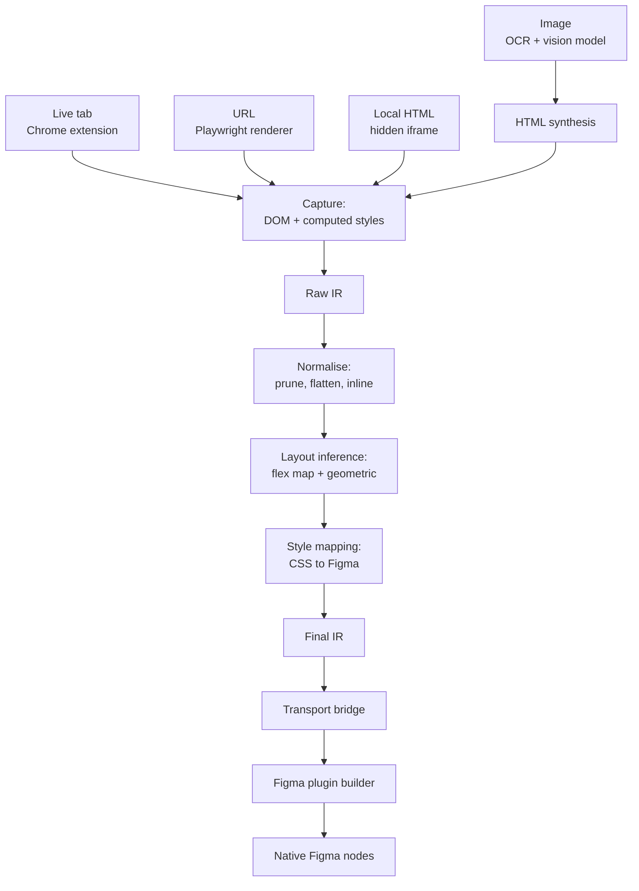
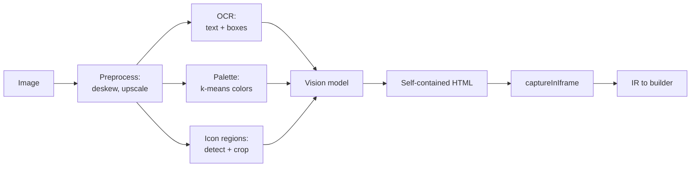

# PRD — Web2Figma: HTML & Image to Editable Figma Converter

2026-09-18 · @Someone

## 1. Overview and goals

Web2Figma converts a live web page, a local HTML file, or a UI screenshot into native, fully editable Figma layers with Auto Layout applied. It is a free, self-hosted alternative to html.to.design and Codia, built as a Figma plugin plus a browser extension.

The product exists because the paid tools charge a subscription for a conversion that is deterministic and runs locally, and because their output is often a flat stack of absolutely positioned frames that a designer cannot actually edit.

### Goals

1. **G1 — Live page capture.** Convert any publicly reachable URL, or the currently open tab, into a Figma frame tree that visually matches the rendered page.
2. **G2 — Real editability.** Output uses Auto Layout wherever the source layout has a defensible analogue, with correct FILL/HUG/FIXED sizing, so resizing a parent reflows children.
3. **G3 — Element picking.** Let the user select a single component on a page (a nav bar, a card, a pricing table) instead of importing the whole document.
4. **G4 — Image to hi-fi UI.** Accept a PNG/JPG of a web page or mobile screen and produce the same class of editable output, not a traced bitmap.
5. **G5 — Honest fidelity.** Every property the converter could not reproduce is reported to the user rather than silently dropped.
6. **G6 — No account, no server dependency.** The default path runs entirely on the user's machine. Cloud services are opt-in and only for the image pipeline.

### Non-goals

- Figma to code. That direction already has good open-source coverage and is out of scope.
- Pixel-perfect reproduction of animation, video, canvas or WebGL content. These rasterise to a static image fill.
- Recreating a design system. The converter does not invent components, variants or variables in v1. Style extraction into Figma variables is deferred to a post-v1 milestone.
- Round-tripping. Edits made in Figma are never pushed back to the source HTML.
- Reverse-engineering Figma's private clipboard format. All node creation goes through the public Plugin API.

### One-line product definition

> Paste a URL or drop an image, get a Figma frame you can immediately redesign.

## 2. Users, use cases and success criteria

The primary user is a product designer who needs an existing interface as a starting point in Figma and does not want to rebuild it by hand.

| Use case | Input | What good looks like |
| --- | --- | --- |
| Competitor teardown | Live URL | Full page imported in under 60s, sections stack in Auto Layout, text is editable |
| Redesign of own product | Live URL, logged-in session | Authenticated page captured from the open tab, not a re-fetch |
| Component harvesting | Element picked on page | Just the nav bar imported, hugging its content |
| Legacy UI with no design file | Screenshot | Editable layers recovered from the image, text exact via OCR |
| AI-generated design import | Local HTML file | Self-contained HTML rebuilt as frames without a network round trip |

### Success criteria

- **Visual accuracy.** Rendered Figma output compared against the source screenshot scores under 5% pixel difference on the golden-page fixture set.
- **Editability.** At least 70% of container frames on a modern site carry Auto Layout, and increasing the root frame width by 200px does not visually break the top three sections.
- **Speed.** A 3,000-node page completes in under 90 seconds on a mid-range laptop.
- **Reliability.** Zero uncaught exceptions across the fixture set; any failure degrades to a rasterised fill for the affected subtree rather than aborting the run.

## 3. System architecture

The architecture rests on one decision: **three input paths converge on a single Intermediate Representation (IR), and exactly one builder consumes it.** Every feature is either a new IR producer or an improvement to the shared pipeline. No input path ever talks to the Figma API directly.



### Process boundaries

There are three separate runtimes and the IR is the only thing that crosses between them.

| Runtime | Has DOM | Has network | Has Figma API | Runs |
| --- | --- | --- | --- | --- |
| Extension content script | Yes | Yes (page origin) | No | Capture, element picking |
| Node CLI / relay | No (Playwright does) | Yes | No | URL rendering, image pipeline, transform |
| Figma plugin UI iframe | Yes | Only if `networkAccess` allows | No | Transport, local HTML rendering, progress UI |
| Figma plugin sandbox | No | No | Yes | Node construction only |

The sandbox is deliberately dumb. It receives a finished IR and translates it one-to-one into API calls. All decisions — what is a text node, what gets Auto Layout, which font substitutes for which — are already made by the time the IR reaches it. This keeps the slowest and hardest-to-debug runtime free of logic and makes the transform layer unit-testable in plain Node.

### Why the IR, and not direct conversion

- The image pipeline and the HTML pipeline share 90% of their work once both emit IR.
- Layout inference can be tested against fixture IR files with no browser and no Figma.
- A future Sketch or Penpot builder is a new consumer, not a rewrite.
- Transport payloads are plain JSON, so any bridge (clipboard, WebSocket, file) works unchanged.

## 4. The Intermediate Representation

The IR is a plain JSON tree. It is versioned, serialisable, and free of any DOM or Figma types. Agent: define this first, in `packages/ir/src/types.ts`, and treat it as frozen once modules depend on it.

```typescript
export const IR_VERSION = 1;

export interface IRDocument {
  version: number;
  source: { kind: 'url' | 'html' | 'image'; ref: string; capturedAt: string };
  viewport: { width: number; height: number; dpr: number };
  root: IRNode;
  fonts: FontRequest[];        // deduped, collected at capture time
  images: Record<string, ImageAsset>;  // id -> base64 payload
  warnings: Warning[];
}

export type IRNode = FrameNode | TextNode | VectorNode | ImageNode;

interface BaseNode {
  id: string;                  // stable, derived from DOM path
  name: string;                // layer name in Figma
  kind: string;
  rect: Rect;                  // absolute, in CSS px, relative to document
  opacity: number;
  visible: boolean;
  rotation?: number;           // degrees, only from 2D rotate()
  blendMode?: BlendMode;
  effects: Effect[];           // shadows, blurs
  meta: { tag: string; classes: string[]; role?: string; testId?: string };
}

export interface Rect { x: number; y: number; w: number; h: number }

export interface FrameNode extends BaseNode {
  kind: 'frame';
  children: IRNode[];
  fills: Paint[];
  strokes: Stroke[];
  corner: [number, number, number, number];
  clip: boolean;               // from overflow
  layout: LayoutSpec;          // filled by the inference engine, not capture
}

export interface TextNode extends BaseNode {
  kind: 'text';
  characters: string;
  segments: TextSegment[];     // ranged styles for mixed inline formatting
  style: TextStyle;            // paragraph-level defaults
}

export interface TextSegment {
  start: number; end: number;
  font: FontRequest;
  size: number;
  color: Paint;
  decoration?: 'UNDERLINE' | 'STRIKETHROUGH';
  link?: string;
}

export interface TextStyle {
  align: 'LEFT' | 'CENTER' | 'RIGHT' | 'JUSTIFIED';
  verticalAlign: 'TOP' | 'CENTER' | 'BOTTOM';
  lineHeight: { unit: 'PIXELS' | 'PERCENT' | 'AUTO'; value?: number };
  letterSpacing: { unit: 'PIXELS' | 'PERCENT'; value: number };
  case?: 'UPPER' | 'LOWER' | 'TITLE';
  autoResize: 'NONE' | 'WIDTH_AND_HEIGHT' | 'HEIGHT';
}

export interface VectorNode extends BaseNode {
  kind: 'vector';
  svg: string;                 // serialised, self-contained SVG string
}

export interface ImageNode extends BaseNode {
  kind: 'image';
  assetId: string;             // key into IRDocument.images
  scaleMode: 'FILL' | 'FIT' | 'CROP' | 'TILE';
  corner: [number, number, number, number];
}
```

### The layout specification

`LayoutSpec` is the part that makes output editable. Capture leaves it as `{ mode: 'NONE' }`; the inference engine fills it.

```typescript
export interface LayoutSpec {
  mode: 'NONE' | 'HORIZONTAL' | 'VERTICAL' | 'WRAP';
  padding: [number, number, number, number];   // top, right, bottom, left
  itemSpacing: number;
  counterAxisSpacing?: number;                 // WRAP only
  primaryAlign: 'MIN' | 'CENTER' | 'MAX' | 'SPACE_BETWEEN';
  counterAlign: 'MIN' | 'CENTER' | 'MAX' | 'BASELINE';
  sizing: { h: Sizing; v: Sizing };            // this node inside its parent
  absolute?: boolean;                          // escapes parent auto layout
  constraints?: { h: Constraint; v: Constraint }; // used when absolute
  confidence: number;                          // 0-1, from the inference pass
  reason: string;                              // 'flex' | 'grid' | 'geometric' | 'fallback'
}

export type Sizing = 'FIXED' | 'HUG' | 'FILL';
```

`confidence` and `reason` are not decoration. The builder uses them: below a configurable threshold (default 0.6) it applies the layout but records a warning, and the UI offers a one-click "flatten inferred layouts" escape hatch.

### Paints, strokes and effects

```typescript
export type Paint = SolidPaint | GradientPaint | ImagePaint;
interface SolidPaint { type: 'SOLID'; color: RGB; opacity: number }
interface GradientPaint {
  type: 'GRADIENT_LINEAR' | 'GRADIENT_RADIAL' | 'GRADIENT_ANGULAR' | 'GRADIENT_DIAMOND';
  stops: { position: number; color: RGBA }[];
  transform: [[number, number, number], [number, number, number]];
}
interface ImagePaint { type: 'IMAGE'; assetId: string; scaleMode: string }

interface Stroke {
  paint: Paint;
  weight: number | [number, number, number, number]; // uniform or per side
  align: 'INSIDE' | 'OUTSIDE' | 'CENTER';
  dash?: number[];
}

type Effect =
  | { type: 'DROP_SHADOW' | 'INNER_SHADOW'; color: RGBA; offset: {x:number;y:number}; radius: number; spread: number }
  | { type: 'LAYER_BLUR' | 'BACKGROUND_BLUR'; radius: number };
```

### Font requests and warnings

```typescript
export interface FontRequest {
  family: string;              // as written in CSS
  weight: number;              // 100-900, resolved
  italic: boolean;
  fallbackStack: string[];     // remaining families from the CSS stack
  classification: 'serif' | 'sans-serif' | 'monospace' | 'display' | 'handwriting';
  resolved?: { family: string; style: string };  // filled by the builder
}

export interface Warning {
  nodeId: string;
  severity: 'info' | 'degraded' | 'dropped';
  property: string;            // 'backdrop-filter', 'font', 'transform'
  message: string;
  fallbackApplied?: string;
}
```

## 5. Module A — Capture layer

Capture produces raw IR from a rendered DOM. It never parses CSS text; it reads resolved values from `getComputedStyle()` and geometry from `getBoundingClientRect()`. Three entry points share one implementation in `packages/capture`.

| Entry point | Where it runs | Handles auth | Use |
| --- | --- | --- | --- |
| `captureDocument(root)` | Extension content script | Yes, uses the live session | Open tab, element picking |
| `captureViaPlaywright(url)` | Node CLI | Via cookie injection | Batch, headless, CI fixtures |
| `captureInIframe(html)` | Plugin UI iframe | N/A | Local HTML, AI-generated designs |

### Pre-capture page preparation

Before walking the DOM, run these in order. Skipping any of them is the single biggest cause of bad output.

1. Scroll the full page height in steps and wait, to trigger lazy-loaded images and IntersectionObserver content. Then scroll back to top.
2. Await `document.fonts.ready`.
3. Await all `` `decode()` promises with a 3s timeout each.
4. Freeze animations: inject a stylesheet setting `*, *::before, *::after { animation-play-state: paused !important; transition: none !important; }`.
5. Dismiss obvious overlays if the user enabled the option: cookie banners and modals matched by a maintained selector list. Log every removal as an `info` warning.
6. Force `scroll-behavior: auto` and record `document.documentElement.scrollHeight` as the root frame height.

### DOM walk rules

Walk depth-first. For each element decide **skip**, **descend**, **emit as leaf**, or **rasterise**.

**Skip entirely** when any holds: `display: none`; `visibility: hidden` with no visible descendant; `opacity: 0` with no children; zero width and zero height; tag in `{script, style, meta, link, noscript, template, head, title}`; the element is fully outside the capture rect; `aria-hidden="true"` with no visible text.

**Emit as text** when the element's direct children include a non-empty text node. Important: an element may have both text and element children — emit the text runs as separate text nodes positioned by `Range.getClientRects()`, not by the parent's box.

**Emit as vector** for `<svg>`. Serialise with `XMLSerializer`, resolve `<use>` references, inline any `currentColor` to the computed colour, and store the string. Do not attempt to translate path data.

**Rasterise the subtree** for `<canvas>` (via `toDataURL()`), `<video>` (capture the current frame to an offscreen canvas), `<iframe>` from a foreign origin, and any element carrying a 3D transform, `filter`, or `mask` the mapping table marks unsupported. Emit a single `ImageNode` covering its rect and log a `degraded` warning.

**Emit as image** for ``, `<picture>`, and any element whose only visual content is a `background-image` of a raster format.

**Descend** in all other cases, emitting a `FrameNode`.

### Style extraction

```typescript
function extractStyles(el: Element): RawStyles {
  const cs = getComputedStyle(el);
  const before = getComputedStyle(el, '::before');
  const after = getComputedStyle(el, '::after');
  // ...
}
```

Pseudo-elements are a named requirement, not an optional extra: icons, dividers, badges and quote marks on real sites live there. When `content` is not `none`, synthesise a sibling node positioned by comparing the parent's border box against the child boxes, with its own fills, size and text. Order it before or after the real children accordingly.

Also extract, per element: all four border widths, styles and colours independently (CSS allows them to differ, Figma does not — see the mapping table); `background-image` including multiple layered backgrounds and gradients; `box-shadow` as a list, splitting inset from outset; `border-radius` per corner including the percentage form; `transform` decomposed via matrix analysis into translate, scale, rotate and skew, keeping only rotation; `overflow` for the `clip` flag; `position` and `z-index` for stacking.

### Image inlining

Inline every image at capture time as a base64 data URI, keyed into `IRDocument.images`. Doing this later is not possible: the plugin sandbox has no network, and the plugin UI iframe would hit CORS on most CDNs.

Method: draw the image to an offscreen canvas and call `toDataURL()`. If the canvas is tainted by a cross-origin source, retry via `fetch(url, { mode: 'cors' })` in the extension background script, which has host permissions the page lacks. If both fail, emit a placeholder rectangle with the average colour sampled from the element's rendered appearance and log a `dropped` warning.

Cap each asset at 2048px on the long edge and re-encode above 500KB as WebP quality 85. Deduplicate by content hash: hero images repeated across sections are common and dominate payload size.

### Element picking

The extension injects an overlay that highlights the hovered element's border box and shows its tag, dimensions and class list. On click, capture runs with that element as root, and the resulting root frame's rect is rebased to `{x: 0, y: 0}`. Shift-click adds to a multi-select; the captured nodes are then wrapped in a synthetic frame.

## 6. Module B — Transport bridge

The Figma plugin cannot reach the page and the page cannot reach the plugin. Three bridges are specified, in build order. Ship T1 first; it works on day one and needs no infrastructure.

**T1 — Clipboard / paste (v1 default).** The extension serialises the IR, gzips it, base64-encodes it, and writes it to the clipboard. The plugin UI has a paste target. Simple and dependency-free, but browsers cap clipboard payloads in practice around 50–100MB and the user feels the size. Mitigate by keeping images in a side-channel: paste the structural IR, and have the plugin request assets one at a time over T2 if available.

**T2 — Local relay (recommended path).** A small Node process on `localhost:3579` exposing `POST /ir` and `GET /ir/:id`. The extension posts; the plugin UI fetches. Requires `"networkAccess": { "allowedDomains": ["http://localhost:3579"] }` in `manifest.json`. Handles arbitrarily large payloads, supports streaming progress, and is what enables the URL-entry mode where the user types a URL into the plugin and a Playwright instance renders it.

**T3 — Hosted endpoint (opt-in, post-v1).** Same contract as T2 against a deployed instance, for users who cannot run a local process. Off by default; the UI must state clearly that page content leaves the machine.

### UI iframe to sandbox

Inside the plugin, the IR still has to cross from the UI iframe to the sandbox via `postMessage`. This channel is structured-clone based and slow for large objects.

- Send the IR without images first, so the sandbox can build the tree skeleton.
- Stream image assets individually, keyed by `assetId`, in chunks under 1MB.
- Never send a single message over \~5MB; it stalls the UI thread visibly.
- Use a sequence number and acknowledge each chunk so the UI can show real progress and retry a dropped chunk.

```typescript
type Envelope =
  | { t: 'begin'; total: number; doc: IRDocument }      // doc.images emptied
  | { t: 'asset'; seq: number; id: string; bytes: string }
  | { t: 'commit' }
  | { t: 'abort'; reason: string };
```

## 7. Module C — Normalisation and layout inference

This module is the difference between a toy and a usable tool. It is pure functions over IR, runs in plain Node, and must be the most heavily tested package in the repo.

### Stage 1 — Normalisation

Run these passes in order before any layout inference.

1. **Prune.** Drop nodes with zero area, fully transparent nodes with no children, and nodes entirely outside the root rect.
2. **Collapse wrappers.** A frame with exactly one child, no fill, no stroke, no effect, no padding difference and the same rect as its child is noise from the framework. Replace it with its child. Repeat to a fixed point. This single pass typically removes 30–50% of nodes on a React site.
3. **Rebase coordinates.** Convert every rect from document-absolute to parent-relative. Do this once, here, not in the builder.
4. **Resolve stacking.** Reorder siblings by paint order: z-index, then positioned-vs-static, then DOM order. Figma's child order is paint order, so this must be correct or overlapping elements render wrong.
5. **Merge text runs.** Adjacent inline text sharing a parent becomes one `TextNode` with multiple `segments`, rather than one node per `<span>`.
6. **Dedupe assets.** Hash image payloads, collapse duplicates, rewrite `assetId` references.

### Stage 2 — Tier 1: direct layout mapping

When the source element has a real layout model, use it. This covers most modern sites.

| CSS | LayoutSpec |
| --- | --- |
| `display: flex; flex-direction: row` | `mode: 'HORIZONTAL'` |
| `display: flex; flex-direction: column` | `mode: 'VERTICAL'` |
| `flex-wrap: wrap` | `mode: 'WRAP'`, `counterAxisSpacing` from `row-gap` |
| `row-reverse` / `column-reverse` | corresponding mode, children array reversed |
| `gap` / `column-gap` | `itemSpacing` |
| `justify-content: flex-start / center / flex-end / space-between` | `primaryAlign: MIN / CENTER / MAX / SPACE_BETWEEN` |
| `justify-content: space-around / space-evenly` | `SPACE_BETWEEN` + a `degraded` warning |
| `align-items: flex-start / center / flex-end / baseline` | `counterAlign: MIN / CENTER / MAX / BASELINE` |
| `align-items: stretch` | `counterAlign: MIN`, children get `sizing.v = FILL` |
| `padding-*` | `padding` tuple |
| `flex-grow > 0` on a child | child `sizing` on the main axis = `FILL` |
| `width: 100%` / `flex: 1` | `FILL` |
| `width: fit-content` / intrinsic | `HUG` |
| `position: absolute / fixed` | `absolute: true` + constraints from `top/right/bottom/left` |

Set `reason: 'flex'` and `confidence: 1.0`.

**CSS Grid** is harder because Figma has no grid. Map single-row and single-column grids to the corresponding Auto Layout direction. For a true 2D grid, emit nested Auto Layout: a vertical parent of horizontal row frames, one per grid row, with children assigned by their computed `grid-row`. Set `reason: 'grid'`, `confidence: 0.8`. If the grid has spanning cells that break the row structure, fall back to `mode: 'NONE'` with absolute children and log a `degraded` warning.

### Stage 3 — Tier 2: geometric inference

For `display: block`, `inline-block`, tables and anything else, infer layout from geometry. This is the algorithm to get right.

```typescript
function inferLayout(parent: FrameNode): LayoutSpec {
  const kids = parent.children.filter(k => !k.layout?.absolute);
  if (kids.length === 0) return { mode: 'NONE', confidence: 1, reason: 'leaf', ... };
  if (kids.length === 1) return inferSingleChild(parent, kids[0]);

  const v = scoreAxis(kids, 'vertical');
  const h = scoreAxis(kids, 'horizontal');
  const best = v.score >= h.score ? v : h;

  if (best.score < THRESHOLD) return fallbackAbsolute(parent);
  return buildSpec(parent, kids, best);
}
```

**Axis scoring.** For the vertical hypothesis: sort children by `rect.y`. Compute (a) *separation* — the fraction of adjacent pairs whose Y ranges do not overlap by more than 2px; (b) *alignment* — the fraction of children sharing a left edge, a right edge, or a centre within 2px; (c) *gap regularity* — `1 - min(1, stdev(gaps) / max(1, mean(gaps)))`. Score is `0.5·separation + 0.3·alignment + 0.2·gapRegularity`. Mirror the whole thing for horizontal using X. Default `THRESHOLD = 0.65`.

**Spacing.** If gap regularity is above 0.85, set `itemSpacing = round(mean(gaps))` and let Auto Layout distribute. Otherwise set `itemSpacing = 0` and convert the actual gaps into per-child margins — implemented as top padding on wrapper frames, since Figma has no per-child margin. Prefer the first; the second is a compatibility escape.

**Padding.** Compute from the parent's content box: `paddingLeft = min(child.x) - 0`, `paddingTop = min(child.y)`, `paddingRight = parent.w - max(child.x + child.w)`, `paddingBottom = parent.h - max(child.y + child.h)`. Clamp negatives to 0 and log if a child overflows its parent.

**Alignment.** On the counter axis, if all children share a left edge → `MIN`; a right edge → `MAX`; a centre → `CENTER`; if they vary, pick the majority and leave the outliers with `sizing` `FIXED`. On the primary axis, if the first child starts at the parent's padding edge and the last ends at the opposite padding edge while the interior gaps are much larger than the outer padding, `SPACE_BETWEEN` is the honest reading.

**Sizing decisions**, applied per child after the mode is chosen:

- Child width within 1px of parent content width → `FILL`
- Child is text whose measured width is less than its box → `HUG` if the box hugs, else `FILL`
- Child width matches its own children's extent plus its padding → `HUG`
- Otherwise → `FIXED`

The same logic runs on the vertical axis, except that text nodes default to `HUG` vertically so that reflow works when the width changes.

**Wrapping detection.** If children form multiple rows of roughly equal height with consistent horizontal gaps, and the row count is greater than one, emit `mode: 'WRAP'` rather than nested frames. Card grids are the common case and `WRAP` is much nicer to edit.

### Stage 4 — Semantic naming

Layer names matter to the person receiving the file. Derive them in this priority order: `aria-label`; `data-testid`; the element's text content truncated to 24 characters; a semantic tag name (`Header`, `Nav`, `Footer`, `Section`, `Card`, `Button`); the first class name cleaned of hashes and utility noise; finally the tag name. Never emit `div` as a layer name.

Detect and name common patterns: an `<a>` or `<button>` with a background and padding is a `Button`; a repeated sibling structure with an image and text is a `Card`; a `<ul>` of links inside a `<header>` is `Nav`.

## 8. Module D — Figma plugin builder

The builder walks the final IR and creates nodes. It contains no heuristics. Every failure here is a bug in an earlier module.

### Order of operations

This order is not negotiable; several steps fail if run out of sequence.

1. **Collect and load all fonts first.** Walk the whole IR, dedupe `FontRequest`s, resolve each against `figma.listAvailableFontsAsync()`, then `await Promise.all(fonts.map(f => figma.loadFontAsync(f)))`. Setting `characters` or any text style before its font is loaded throws.
2. **Register all image assets.** `figma.createImage(bytes)` for each unique asset, building an `assetId -> imageHash` map.
3. **Create the node tree top-down**, appending children as they are made.
4. **Apply Auto Layout bottom-up.** Set `layoutMode` on a parent only after its children exist, then set each child's `layoutSizingHorizontal` / `layoutSizingVertical`. Sizing properties throw if the parent is not yet an Auto Layout frame.
5. **Apply absolute positioning last.** For children with `absolute: true`, set `layoutPositioning = 'ABSOLUTE'` then `x` / `y`, which are otherwise overwritten by layout.
6. **Zoom to the result** with `figma.viewport.scrollAndZoomIntoView([root])` and `figma.currentPage.selection = [root]`.

### Font resolution

Web fonts mostly do not exist in Figma. Resolve in this order and record every substitution:

1. Exact family and style match against the available font list.
2. Same family, nearest weight — map CSS 100–900 onto whatever styles exist, preferring `Regular` for 400 and `Bold` for 700.
3. Next family in the CSS fallback stack.
4. A curated substitution table for the common web fonts (Helvetica Neue → Inter, SF Pro → Inter, Segoe UI → Inter, Georgia → Source Serif, Menlo → Roboto Mono).
5. Classification-based fallback: sans → Inter, serif → Source Serif Pro, mono → Roboto Mono.
6. Inter Regular, always available.

Write the resolved font back into `FontRequest.resolved` so the conversion report can list substitutions.

### Text construction

```typescript
const t = figma.createText();
t.fontName = segments[0].font.resolved;   // before characters
t.characters = node.characters;
for (const s of node.segments) {
  t.setRangeFontName(s.start, s.end, s.font.resolved);
  t.setRangeFontSize(s.start, s.end, s.size);
  t.setRangeFills(s.start, s.end, [toPaint(s.color)]);
  if (s.decoration) t.setRangeTextDecoration(s.start, s.end, s.decoration);
  if (s.link) t.setRangeHyperlink(s.start, s.end, { type: 'URL', value: s.link });
}
```

Set `textAutoResize` from `style.autoResize`. Prefer `'HEIGHT'` over forcing the browser's exact box: Figma's line breaking differs from the browser's, and a fixed box produces clipped or overflowing text. Accept a 1–3px height difference in exchange for text that reflows correctly when edited.

### Vectors

`figma.createNodeFromSvg(node.svg)` handles paths, groups, fills and strokes correctly. Resize the returned frame to `node.rect` afterwards. Do not translate path data by hand.

### Batching and progress

The sandbox blocks the Figma UI while it runs. Build in batches of 50 nodes and yield between them:

```typescript
let n = 0;
for (const node of walk(ir.root)) {
  build(node);
  if (++n % 50 === 0) {
    figma.ui.postMessage({ t: 'progress', done: n, total });
    await new Promise(r => setTimeout(r, 0));
  }
}
```

Wrap the whole run so that a throw on one node logs a warning, substitutes a plain rectangle of the right size and fill, and continues. A partial import a designer can fix beats an aborted run.

## 9. Module E — Image to hi-fi UI

The design decision that makes this tractable: **do not go image → IR.** Go image → self-contained HTML → the existing capture pipeline. Every gain in layout inference, font handling and Auto Layout then applies to screenshots for free.



### Why OCR separately

A vision model asked to transcribe a dense UI will paraphrase, drop items, and hallucinate plausible copy. Running OCR first and passing the result as ground truth removes the failure mode entirely. Use Tesseract.js locally, or a cloud OCR for accuracy. Pass the model a list of `{ text, x, y, w, h, estimatedFontSize }` and instruct it to use those strings verbatim.

Estimate font size from the OCR bounding box height divided by roughly 1.4 for Latin text, and cluster sizes across the page so that body text lands on one consistent value rather than drifting by a pixel per line.

### Palette and icons

Run k-means over the image pixels (k = 8) to extract a palette, and pass hex values to the model. This stops it from inventing approximate colours. Separately, detect small high-contrast regions that contain no OCR text — those are icons. Crop each, and either vectorise with potrace or pass the crop through as an image asset. Give the model the icon positions and let it place `` placeholders that the capture step resolves to the crops.

### Vision model prompt contract

The prompt must pin the output format hard. Key instructions:

- Return a single HTML document, no markdown fence, no commentary.
- All CSS inline in one `<style>` block. No external resources, no web font imports.
- Use flexbox for every container. Never use absolute positioning unless an element genuinely overlaps another.
- Use only the supplied palette hex values and the supplied text strings verbatim.
- Set the body width to the image width so the rendered result matches 1:1.
- Add `data-role` attributes (`header`, `nav`, `card`, `button`, `input`) so the naming pass produces good layer names.

Flexbox is required because it maps to Auto Layout at `confidence: 1.0`. A model that emits absolute positioning throws away the whole point of the pipeline.

### Verification loop

Optional but high-value: render the generated HTML headlessly, screenshot it, and compute a perceptual diff against the input image. If the difference exceeds a threshold, send both images back to the model with the diff and ask for a correction. Two iterations is usually the point of diminishing returns. Cap it at three.

### Expectations to set in the UI

The output is a starting point, not a reproduction. Tell the user so. Quality degrades sharply with compressed screenshots, photos of screens, and cropped images with partial elements. The UI should ask for full-resolution, uncropped images and warn when the input is below 1000px wide.

## 10. CSS to Figma mapping reference

Implement this table in `packages/transform/src/mapping/`. One file per property group, each a pure function with its own unit tests.

| CSS property | Figma target | Notes |
| --- | --- | --- |
| `background-color` | `fills` SOLID | Multiply alpha into `opacity` |
| `background-image: linear-gradient` | `GRADIENT_LINEAR` | Convert CSS angle to Figma's transform matrix; CSS 0deg points up, Figma's differs |
| `background-image: radial-gradient` | `GRADIENT_RADIAL` | Only circular and elliptical centred forms map cleanly |
| `background-image: conic-gradient` | `GRADIENT_ANGULAR` | Direct |
| Multiple backgrounds | Stacked `fills` | Figma paints bottom-to-top, CSS top-to-bottom — reverse the array |
| `background-size` / `-position` | `scaleMode` + image transform | `cover`→FILL, `contain`→FIT, `repeat`→TILE |
| `color` | text `fills` |  |
| `border` uniform | `strokes` + `strokeWeight`, align INSIDE |  |
| `border` non-uniform | Four separate 1px frames | Figma has no per-side stroke on a frame |
| `border-style: dashed / dotted` | `dashPattern` | dotted → `[w, w]`, dashed → `[3w, 2w]` |
| `border-radius` | `topLeftRadius` etc. | Percentages resolve against the box; clamp to half the shorter side |
| `box-shadow` outset | `DROP_SHADOW` effect | Multiple shadows map to multiple effects |
| `box-shadow: inset` | `INNER_SHADOW` effect |  |
| `filter: blur()` | `LAYER_BLUR` | Other filter functions are unsupported → rasterise |
| `backdrop-filter: blur()` | `BACKGROUND_BLUR` | Only the blur function; others rasterise |
| `opacity` | `opacity` |  |
| `mix-blend-mode` | `blendMode` | Names differ; maintain an explicit map, unsupported values → NORMAL |
| `overflow: hidden / clip / auto / scroll` | `clipsContent: true` |  |
| `transform: rotate()` | `rotation` | Figma rotates counter-clockwise from the centre; CSS clockwise. Negate |
| `transform: scale()` | Bake into `rect` | Geometry already reflects it via `getBoundingClientRect` |
| `transform: skew()` / `matrix3d` / `perspective` | — | Unsupported. Rasterise the subtree |
| `font-family` | `fontName.family` | Via the resolution ladder in §8 |
| `font-weight` + `font-style` | `fontName.style` |  |
| `font-size` | `fontSize` |  |
| `line-height: normal` | `lineHeight: AUTO` |  |
| `line-height: <n>px` / unitless | `PIXELS` / `PERCENT` | Multiply unitless by font size or send as percent |
| `letter-spacing` | `letterSpacing` | `normal` → 0 |
| `text-align` | `textAlignHorizontal` | `start`/`end` resolve via direction |
| `text-transform` | `textCase` |  |
| `text-decoration` | `textDecoration` | Only underline and strikethrough |
| `text-overflow: ellipsis` | `textTruncation` | Requires a fixed width |
| `-webkit-line-clamp` | `maxLines` |  |
| `writing-mode: vertical-*` | — | Unsupported. Rasterise |
| `clip-path` / `mask-image` | — | Unsupported. Rasterise |
| `position: sticky` | Treated as `static` | Capture the resting position, log `info` |

### Fallback policy

When a property cannot map, choose in this order and always log a `Warning`:

1. **Approximate** if the visual difference is small (`space-around` → `SPACE_BETWEEN`).
2. **Rasterise the smallest enclosing subtree** if the effect is visual and localised (`clip-path`, `filter: hue-rotate`).
3. **Drop** only when the property has no visual consequence in a static render (`cursor`, `transition`, `will-change`) — these are logged at `info` and do not appear in the user-facing report.

## 11. Performance budgets and constraints

A real landing page produces 3,000–10,000 DOM elements. Naive implementations take ten minutes or crash the plugin. These budgets are requirements, not aspirations.

| Stage | Budget for a 3,000-node page | Mitigation if exceeded |
| --- | --- | --- |
| Capture | < 10s | Batch `getComputedStyle` reads; never interleave reads and writes (layout thrashing) |
| Normalisation | < 2s | Wrapper collapsing should remove 30–50% of nodes before anything else runs |
| Layout inference | < 5s | Cache axis scores; skip nodes with fewer than 2 children |
| Transport | < 10s | Gzip; images out-of-band |
| Build | < 60s | 50-node batches with yields |

### Hard limits to respect

- **Node ceiling.** Above 12,000 nodes, refuse and offer to capture a section instead. Figma itself degrades badly past this.
- **postMessage size.** Keep any single message under 5MB. Larger messages visibly stall the plugin UI.
- **Image memory.** `figma.createImage` holds bytes in memory; cap total assets at 100MB and downsample past that.
- **Sandbox has no network, no DOM, no `setTimeout` longer than the run.** Everything the builder needs must arrive over `postMessage`.
- **Plugin run time.** Figma does not hard-kill long plugins, but the UI is frozen between yields. Never go more than \~100ms without yielding.

### Layout thrashing

The single largest capture cost is alternating between reading layout (`getBoundingClientRect`, `getComputedStyle`) and mutating the DOM. Do all reads in one pass into a plain array, then all writes. The pseudo-element and overlay-removal steps must be fully separated from the measurement pass.

## 12. Error handling and the conversion report

The product promise is honesty about fidelity. Silent degradation is the failure mode that makes users distrust these tools.

### Failure containment

Every node build is wrapped. A throw produces a placeholder rectangle at the correct rect with the node's background fill, named `⚠ <original name>`, plus a `dropped` warning. The run continues. An abort is only acceptable when the IR itself is malformed or the node ceiling is exceeded.

### The report

After the build, the plugin UI shows a summary the user can expand:

- Nodes created, by kind.
- Auto Layout coverage: percentage of frames with a layout mode, split by `reason` (flex, grid, geometric, fallback).
- Font substitutions: a table of requested font to resolved font.
- Degraded properties: grouped by property, with a count and a "select affected layers" button that runs `figma.currentPage.selection = nodes`.
- Dropped content: images that failed to load, rasterised subtrees.

The "select affected layers" action is what turns the report from a disclaimer into a tool. A designer fixes twelve `backdrop-filter` frames in one pass because the plugin selected them.

### Escape hatches

Two post-build actions, both operating on the current selection:

1. **Flatten inferred layouts** — removes Auto Layout from every frame whose `confidence` was below threshold, restoring absolute positioning. For when the inference guessed wrong on a complex page.
2. **Rasterise subtree** — replaces a selection with a flattened image, for sections that imported badly and only need to be a visual reference.

Store `confidence` and `reason` on each node via `setPluginData` at build time so these actions can find their targets later.

## 13. Repository, stack and licensing

A pnpm workspace monorepo. TypeScript strict mode everywhere.

```
web2figma/
├── packages/
│   ├── ir/                 # Types only. No dependencies. Everything imports this.
│   ├── capture/            # DOM walking, style extraction. Browser-only.
│   ├── transform/          # Normalise, infer layout, map styles. Pure, isomorphic.
│   │   ├── normalize/
│   │   ├── layout/         # Tier 1 + Tier 2 inference
│   │   └── mapping/        # One file per CSS property group
│   ├── image-pipeline/     # OCR, palette, vision model, HTML synthesis. Node-only.
│   └── shared/             # Logging, warnings, hashing, gzip
├── apps/
│   ├── plugin/             # Figma plugin
│   │   ├── src/code.ts     # Sandbox: builder only
│   │   ├── src/ui/         # UI iframe: React, transport, progress, report
│   │   └── manifest.json
│   ├── extension/          # Chrome MV3 extension
│   │   ├── content/        # Injects capture, element picker overlay
│   │   ├── background/     # CORS-exempt fetching, relay posting
│   │   └── popup/
│   └── relay/              # Local Node server + Playwright renderer
├── fixtures/               # Golden pages + expected IR snapshots
└── tools/                  # Visual diff harness
```

### Stack

| Concern | Choice | Why |
| --- | --- | --- |
| Language | TypeScript 5.x, strict | The IR contract is the whole design; types enforce it |
| Build | esbuild | Figma plugins need a single bundled file; esbuild is fast enough for watch mode |
| Plugin UI | React + Vite | Familiar, and the iframe is a normal browser context |
| Extension | Manifest V3, vanilla TS in content scripts | Keep the injected bundle small; React in a content script bloats it |
| Headless | Playwright | Better than Puppeteer for font rendering consistency and device emulation |
| Testing | Vitest + Playwright | Vitest for the pure transform package, Playwright for end-to-end fixtures |
| OCR | Tesseract.js, cloud OCR optional | Local by default per goal G6 |

### Prior art and licensing

Read these before writing the capture package. Do not copy code wholesale, but the failure modes they have already solved are worth hours.

| Project | License | What to take |
| --- | --- | --- |
| [@builder.io/html-to-figma](https://github.com/BuilderIO/figma-html) | MIT | The original DOM-to-Figma serialisation; the style extraction approach |
| [aca-so/tofig](https://github.com/aca-so/tofig) | MIT | The hidden-iframe rendering trick inside the plugin UI; font fallback ladder |
| [kbishopzz/HTML-to-Figma](https://github.com/kbishopzz/HTML-to-Figma) | See repo | Puppeteer extraction server pattern, dual manual/automatic modes |
| [octavioamu/element-to-figma](https://github.com/octavioamu/element-to-figma) | See repo | Element picker overlay UX |
| [bernaferrari/FigmaToCode](https://github.com/bernaferrari/FigmaToCode) | MIT | The inverse direction; its Auto Layout reasoning is instructive in reverse |

License this project MIT. Check each dependency's license before vendoring anything. Do not reverse-engineer or depend on Figma's clipboard `figmeta` format: it is undocumented, changes between versions, and sits in a grey area with Figma's terms. Everything goes through the public Plugin API.

## 14. Build milestones

Each milestone is independently demoable. Do not start the next until the acceptance criteria pass.

### M0 — Walking skeleton (target: 2 days)

Plugin scaffold, IR types frozen, hardcoded three-node IR built into Figma. No capture, no inference.

*Accepts when:* `Plugins → Development → Web2Figma` creates a blue frame containing a text node and a rectangle.

### M1 — Local HTML import (target: 1 week)

Capture via hidden iframe in the plugin UI. Full style mapping for fills, strokes, radius, shadows, text. No Auto Layout yet — everything absolute.

*Accepts when:* a self-contained HTML file with nested divs, text, an inline SVG and a data-URI image renders in Figma within 5% pixel difference of the browser.

### M2 — Tier 1 Auto Layout (target: 1 week)

Flex and grid mapping, sizing decisions, absolute-positioned escapes.

*Accepts when:* a flexbox card grid imports with Auto Layout throughout, and widening the root frame reflows the cards correctly.

### M3 — Live page capture (target: 2 weeks)

Chrome extension, content script capture, pre-capture preparation, image inlining via the background script, T1 clipboard transport.

*Accepts when:* five real sites from the fixture set import end to end from the open tab, with all images present.

### M4 — Tier 2 geometric inference (target: 2–3 weeks)

The axis-scoring algorithm, spacing and padding derivation, wrap detection, confidence scores, semantic naming.

*Accepts when:* Auto Layout coverage across the fixture set exceeds 70% of frames, and the flatten escape hatch works.

### M5 — Element picking and relay (target: 1 week)

Overlay picker, multi-select, T2 local relay, URL-entry mode with Playwright.

*Accepts when:* a user types a URL into the plugin and gets a result without touching the browser, and can alternatively pick a single nav bar from the open tab.

### M6 — Image to UI (target: 2–3 weeks)

OCR, palette extraction, icon detection, vision model prompt, verification loop.

*Accepts when:* a 1440px screenshot of a SaaS dashboard produces an editable Figma frame with exact text, correct palette, and Auto Layout on the sidebar and card grid.

### Post-v1 backlog

Variable extraction (colours and type scales into Figma variables), component detection from repeated structures, responsive capture at multiple breakpoints into separate frames, Figma Slides output, Firefox extension.

## 15. Testing strategy

The transform package is pure and must be near-100% covered. Everything else is tested through fixtures.

### Golden fixtures

Maintain `fixtures/` with a frozen copy of each test page — full HTML with inlined assets, so tests do not depend on live sites. Start with these shapes:

| Fixture | Exercises |
| --- | --- |
| `flex-card-grid` | Tier 1 mapping, wrap detection, FILL sizing |
| `legacy-float-layout` | Tier 2 geometric inference with no flex anywhere |
| `pricing-table` | Table layout, borders per side, repeated structure naming |
| `marketing-hero` | Gradients, background images, absolute overlays, large type |
| `dense-dashboard` | Node volume, nested scroll containers, icon-heavy SVG |
| `pseudo-elements` | `::before` icons, dividers, quote marks |
| `mixed-inline-text` | Ranged font styles, links inside paragraphs |
| `unsupported-css` | `clip-path`, `skew`, `backdrop-filter` — asserts correct degradation |

Each fixture stores an expected IR snapshot. Changes to the snapshot must be reviewed deliberately, not auto-accepted.

### Test layers

1. **Unit (Vitest).** Every mapping function. Every inference sub-function — `scoreAxis`, padding derivation, sizing decisions — with hand-built node arrays. This is where the algorithm gets correct.
2. **Snapshot.** Fixture HTML → IR, compared against the stored snapshot. Catches capture regressions.
3. **Visual diff (Playwright).** Render the fixture in a browser, screenshot it. Build the IR in Figma, export the frame as PNG via the plugin, screenshot that. Compare with pixelmatch. Assert under 5% difference. This is the only test that catches the errors that matter most.
4. **Editability assertion.** After building a fixture in Figma, programmatically increase the root frame width by 200px, re-export, and assert no text is clipped and no element overlaps another. This is what proves Auto Layout is real rather than decorative.

### A note on the visual diff harness

Building the Figma side of the visual diff requires driving the plugin headlessly, which Figma does not support directly. The practical approach: run the builder against a mock Figma API that produces an SVG or canvas render of the node tree, and diff against that. It is an approximation of Figma's renderer, but it catches almost every regression and runs in CI without a Figma session.

## 16. Instructions for the implementing agent

This section is addressed directly to the AI coding agent building this system. Read §4 and §7 before writing any code.

### Working rules

1. **The IR is the contract.** Define `packages/ir/src/types.ts` in your first commit and do not change it casually. When a change is genuinely needed, bump `IR_VERSION` and update every consumer in the same commit.
2. **Never let Figma types leak out of the builder.** `packages/transform` must compile and test in plain Node with no `@figma/plugin-typings` import. If you find yourself importing Figma types into transform, the logic is in the wrong place.
3. **Never let DOM types leak out of capture.** Same rule, mirrored.
4. **One milestone at a time.** Do not scaffold M6 while M2 is unfinished. Each milestone's acceptance criteria are the definition of done.
5. **Write the test first for anything in `transform/layout`.** The inference algorithm is where bugs hide and where hand-testing is slowest.
6. **Log, never swallow.** Any branch that degrades output pushes a `Warning`. A silent `catch {}` is a bug.
7. **Commit fixtures, not live URLs.** Tests that fetch the internet will break and you will disable them.

### Order of operations for each milestone

For every milestone: read the relevant PRD section, write the types, write the tests against the fixture, implement until green, run the visual diff, then record in the repo's `PROGRESS.md` what passed and what was deferred.

### Known traps, in the order you will hit them

- **Fonts throw.** `figma.loadFontAsync` must resolve for every font before any `characters` assignment. Load them all up front.
- **Sizing throws.** `layoutSizingHorizontal` on a child fails unless the parent already has `layoutMode` set. Bottom-up, always.
- **Absolute children get moved.** Set `layoutPositioning = 'ABSOLUTE'` before setting `x`/`y`, or layout overwrites them.
- **Paint order is reversed.** CSS lists backgrounds top-first, Figma paints bottom-first. Reverse the fills array.
- **Rotation direction is reversed.** Negate the CSS angle.
- **Canvas tainting.** Cross-origin images silently fail `toDataURL`. The extension background script is the only place with the permissions to fetch them.
- **Layout thrashing.** Interleaving `getComputedStyle` with DOM writes turns a 5-second capture into a 5-minute one.
- **postMessage stalls.** A single large message freezes the plugin UI with no error. Chunk everything.

### Definition of done for v1

All of M0 through M5 pass their acceptance criteria, the fixture set runs green in CI, Auto Layout coverage exceeds 70%, and a first-time user can install the extension and the plugin, open a site, and get an editable Figma frame without reading documentation.

### Open decisions for the product owner

- Whether the local relay ships in v1 or v2. It is the better experience but adds an install step.
- Which vision model backs M6, and whether the key is user-supplied or bundled.
- Whether to pursue a Figma Community listing, which brings review requirements, or stay a manually installed development plugin.
